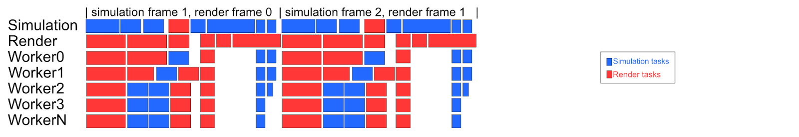
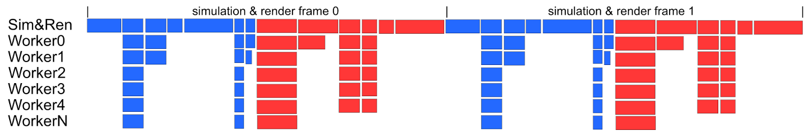

# Overview

## Introduction

When we started writing Bitsquid back in mid 2009 all platforms we intended to run on were already multi-core architectures. This and the fact that we had some prior experience trying to get our last engine to run efficiently on the PS3 answered the question how not to architecture an efficient renderer that scales to many cores. We knew we needed more than functional parallelism, we wanted data-parallelism.

To solve that we divide the CPU view of a rendered frame into three stages:

 * Culling - Filter out visible renderable objects with respect to a camera from a potentially huge set of different type of objects (meshes, particle systems, lights, etc).
 * Render - Iterate over the filtered result from Culling and “record” an intermediate representation of draw calls/state switches to a command buffer.
 * Dispatch - Take result from Render and translate that into actual render API calls (D3D, OGL, Metal, GNM, etc).

As you can see each stage pipes its result into the next. Rendering is typically very simple in that sense; we tend to have a one way flow of our data: [[user input or time affects state, state propagates into changes of the renderable objects (transforms, shader constants, etc), figure out what need to be rendered, iterate over that and finally generate render API calls. Rinse & Repeat :]]

If we ignore the problem of ordering the final API calls in the rendering backend it’s fairly easy to see how we can achieve data parallelism in this scenario. Just fork at each stage splitting the workload into a n-chunks (where n is however many worker threads you can throw at it). When all workers are done for a stage take the result and pipe into the next stage.

In essence this is how all rendering in Stingray works. Obviously I’ve glanced over some rather important and challenging details but as you will see they are not too hard to solve if you have good control over your data flows and are picky about when mutation of the data happens.

## Design Philosophies & Concepts

The rendering code in Stingray tends to be heavily influenced by Data Oriented Programming principles. When designing new systems our biggest efforts usually goes into structuring our data efficiently and thinking about its flow through the systems, more so than writing the actual code that transforms the data from one form to another.

To achieve data-parallelism throughout the rendering code the first thing to realize is that we have to be very picky about when mutation of the renderable objects happens. Multiple worker threads will run over our objects and its not unlikely that more than one thread visits the same object at the same time, hence we must not mutate the state of our objects in its render function. Therefore all of our render() functions are const.

To further guard ourselves from the outer world (i.e gameplay, physics, etc) the renderer operates in complete isolation from the game logics. It has its own representation of the data it needs, and only the data relevant for rendering. While the gameplay logics usually wants to reason about high-level concepts such as game entities (which basically groups a number of meshes, particle systems, lights, etc together), we on the rendering side don’t really care about that. We are much more interested in just having an array of all renderable objects in a game world, in a memory layout that makes it efficient to access.

Another nice thing with decoupling the representation of the renderable objects from the game objects is that it allows us to run simulation in parallel with rendering (functional parallelism). So while simulation is updating frame n the renderer is processing frame n-1. Some of you might argue that overlaying rendering on top of simulation doesn’t give any performance improvements if the work in all systems is nicely parallelized. In reality though this isn’t really the case. We still have systems that don’t go wide, or have certain sections where they need to do synchronous processing (last generation graphics APIs: e.g DX11, OpenGL are good examples). This creates bubbles in the frame slowing us down.

By overlaying simulation and rendering we get a form of bubble filling among the worker threads which in most cases gives a big enough speed improvement to justify the added complexity that comes from this architecture. More specifically:

 * Double buffering of state - since the simulation might mutate the state of an object for frame n at the same time as the renderer is processing frame n-1 any mutable state needs to be double buffered.
 * Life scope tracking of immutable data - while immutable/read only state such as static vertex and index buffers are safe to read by both simulation and renderer we still need to be careful not pulling the rug under the renderers feet by freeing anything still being in use by the renderer.

Here’s a conceptual graph showing the benefits of overlaying simulation and rendering:

So basically what we got here is two "controller threads": simulation and render both offloading work to the worker threads. In the case that a controller thread is blocked waiting for some work to finish it will assist the worker threads striving to never sit idle. One thing to note is that to prevent frames from stacking up, we never allow the simulation thread to run more than one frame ahead of the render thread.

As a comparison here’s the same workload with simulation and rendering running in sequence.

As you can see we get significantly more idle time (bubbles) on the worker threads due to certain parts of both the simulation and rendering not being able to go wide.

## Next up

I think this pretty much covers the high level view of the core rendering architecture in Stingray. Now lets go into some more detail.

Since Andreas Asplund recently covered both how we handle propagation of state from simulation to the renderer (we call this "State reflection" in Stingray): [state reflection](02_state_reflection.md) as well as how our view frustum culling system(s) works: [the implementation of frustum culling](03_the_implementation_of_frustum_culling.md), I won’t be covering that in this series.

Instead I will jump straight into how creating and destroying GPU resources works, and from there go through all the building blocks needed to implement the second stage Render mentioned above.
